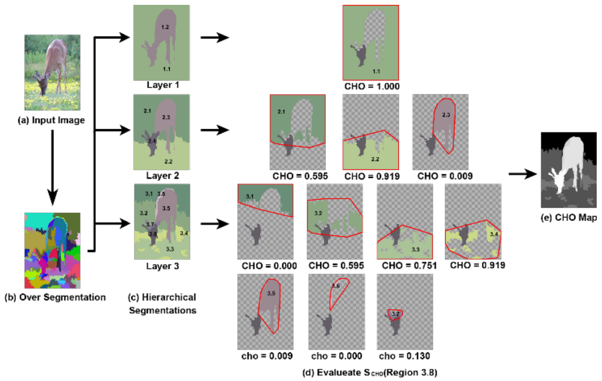

# Salient Object Detection With Convex Hull Overlap

In this paper, we establish a novel bottom-up cue named Convex Hull Overlap (CHO), and then propose an effective approach to detect salient object using the combination of the CHO cue and global contrast cue. Our scheme significantly differs from other earlier work in: 1) The hierarchical segmentation model based on Normalized Graph-Cut fits the splitting and merging processes in human visual perception; 2) Previous work only focuses on color and texture cues, while our CHO cue makes up the obvious gap between the spatial region covering and the region saliency. CHO is a kind of improved and enhanced Gestalt cue, while other popular figure-ground cues such as convexity and surroundedness can be regarded as the special cases of CHO. Our experiments on a large number of public data have obtained very positive results.

This paper was published in IEEE International Conference on Big Data (Big Data), workshop, 2018. The [link](https://ieeexplore.ieee.org/document/8622033) to view the full text.



## Usage

Download the salient object detection dataset `ECSSD` from the website `http://www.cse.cuhk.edu.hk/leojia/projects/hsaliency/dataset.html`.
Then change the path in `main.cpp` to your own path of the dataset.
```
	string dataset_name = "ECSSD/";
	string dir_path = "/mnt/e/Dataset/" + dataset_name;
	string gt_dir_path = dir_path + "ground_truth_mask/";
	string img_dir_path = dir_path + "images/";
```

Run `make` in the command line to compile the code.
Use `./SOD_CHO` to execute the program.
